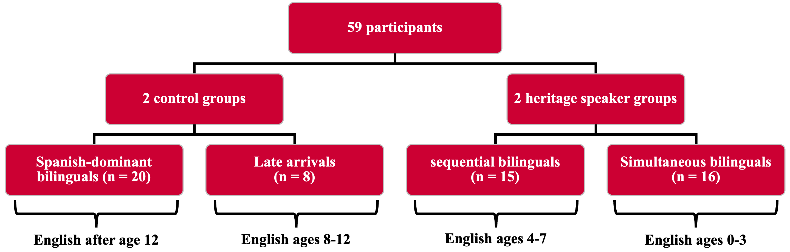

```{r setup, echo = FALSE, include = FALSE, warning = FALSE}
knitr::opts_chunk$set(echo = FALSE, message = FALSE, warning = FALSE)
options(scipen = 999)

library(tidyverse)
library(knitr)
library(kableExtra)
library(xaringan)
library(patchwork)
```

---
# Context

- Origin of theory of **.RUred[incomplete acquisition]** in heritage language grammars


--
  + Less exposure to Spanish in childhood results in incomplete grammatical knowledge


--
  + Proposed outcome of acquisition; final state grammar


--
- Early foundational research in heritage language acquisition


--
  + Central question *Why do heritage speakers differ from other native speakers?*


--
  + Can *age of onset of bilingualism* capture variability?

---
# Introduction to Aspect

- Study of the acquisition of the **.RUred[grammatical aspect]** in Spanish (preterit/imperfect)


--
  + **Preterit:** "bounded" and complete events


--
  + **Imperfect:** "unbounded" and complete events


--
- Preterit and imperfect conjugations can be used with any verb


--
- Certain verbs are more conducive to either the preterit or imperfect


--
  + Verbs that describe accomplishments and achievements typically carry preterit morphology


--
  + Verbs that describe states and activities typically carry imperfect morphology
  
---
# The study

- No explicitly stated research questions!


--
  + "The central concern of this study was whether adult bilinguals who were exposed to two languages simultaneously and sequentially as children acquired full linguistic competence." (p. 57)


--
  + Of course, this question cannot be answered through the study of aspect alone!


--
- Apparent question: does age of acquisition of English affect the ability to use the fully-specified preterit/imperfect contrast in Spanish?


--
  + Do heritage speakers (HS) use the preterit and imperfect in the expected contexts?


--
  + Can HS use the preterit with states/activities and the imperfect with achievements/ accomplishments?


--
- 4 offline tasks

--
  + Written forced choice task ("morphology recognition", 30 items)

--
  + Oral narrative production task

--
  + Written grammaticality judgment task ("sentence conjunction")

--
 + Written truth value judgment task


---
# Participants

- 59 participants


--
  + 20 Spanish-dominant bilinguals (English after age 12)


--
  + 8 "late arrivals" (English between ages 8 and 12)


--
  + 15 sequential bilinguals (English between ages 4 and 7)


--
  + 16 simultaneous bilinguals (English and Spanish from birth or before age 4)


--
```{r, participant-chart}

```

---
# Format of analysis

- Analysis of four areas:

--
  + Use of preterit with accomplishments and achievements (typical pairing; first acquired)

--
  + Use of imperfect with activities and states (typical pairing; next acquired)

--
  + .RUred[Use of imperfect with accomplishments and achievements] (atypical pairing; hard*er* to acquire)

--
  + .RUred[Use of preterit with activities and states] (atypical pairing; hard*est* to acquire)